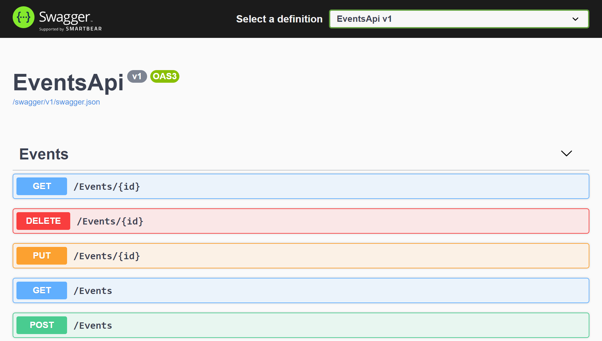
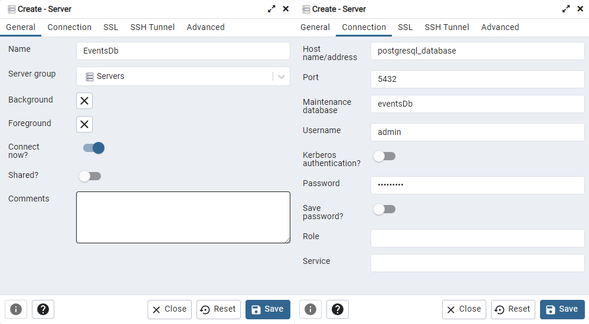

# EventsApi

## Описание
Разработка CRUD Web API для работы с мероприятиями (создание, изменение, удаление, получение), выполняется на ASP .Net Core, с использованием EF Core.

### Функционал Web API
1. Получение списка всех событий;
2. Получение определённого события по его Id;
3. Регистрация нового события;
4. Изменение информации о существующем событии;
5. Удаление события;

### Информация о событии
1. Название/тема;
2. Описание, план;
3. Организатор, спикер;
4. Время и место его проведения;

### Необходимые к использованию технологии
1. .Net 5.0+;
2. ASP .Net Core;
3. Entity Framework Core;
4. PostgreSQL 12+

## Сборка
1. В корне репозитория выполните `docker-compose up -d` для сборки образа PostreSQL и PGAdmin, это займёт некоторое время.
2. Перейдите в PGAdmin по адресу http://localhost:5050/login и войдите по логину и паролю из `docker-compose.yml`.
3. Создайте в PGAdmin новый сервер, во вкладке `General` укажите название `EventsDb`, во `Connection` укажите данные для подключения из `docker-compose.yml`.
   
4. Если вы не устанавливали ранее пакет `EntityFrameworkCore.Design` выполните `dotnet tool install --global dotnet-ef`.
5. Выполняем `dotnet ef database update -p .\src\Events.Api\EventsApi.csproj` в корне репозитория, для обновления базы данных PostgreSQL через `InitialMigration`.
6. Запускаем проект.